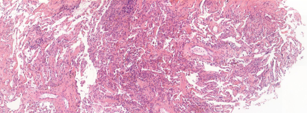

# DigiLut Data Challenge (2024)

**This project is my submission to the DigiLut competition.**

The [**DigiLut challenge**](https://app.trustii.io/datasets/1526), a collaborative project between Trustii.io and Foch Hospital and supported by the Health Data Hub and Bpifrance, aims to develop a medical decision support algorithm to diagnose graft rejection episodes in lung transplant patients by detecting pathological regions (A lesions) on transbronchial biopsies.

[:octicons-arrow-right-24: Install the project on your machine](./install.md){ .md-button }

[:octicons-arrow-right-24: Discover my AI approach to solve this data challenge](./approach.md){ .md-button .md-button--primary }

## 👋 Contributing

If you encounter any issues with the repo or have suggestions for improvements, feel free to open an issue or submit a pull request.
