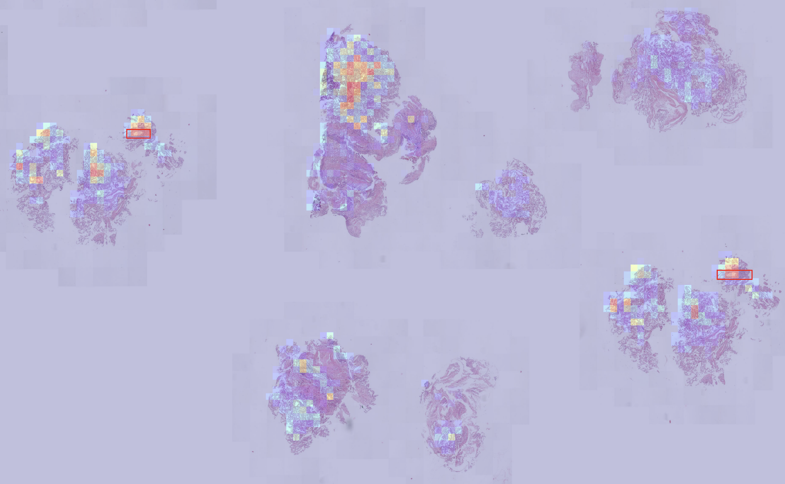
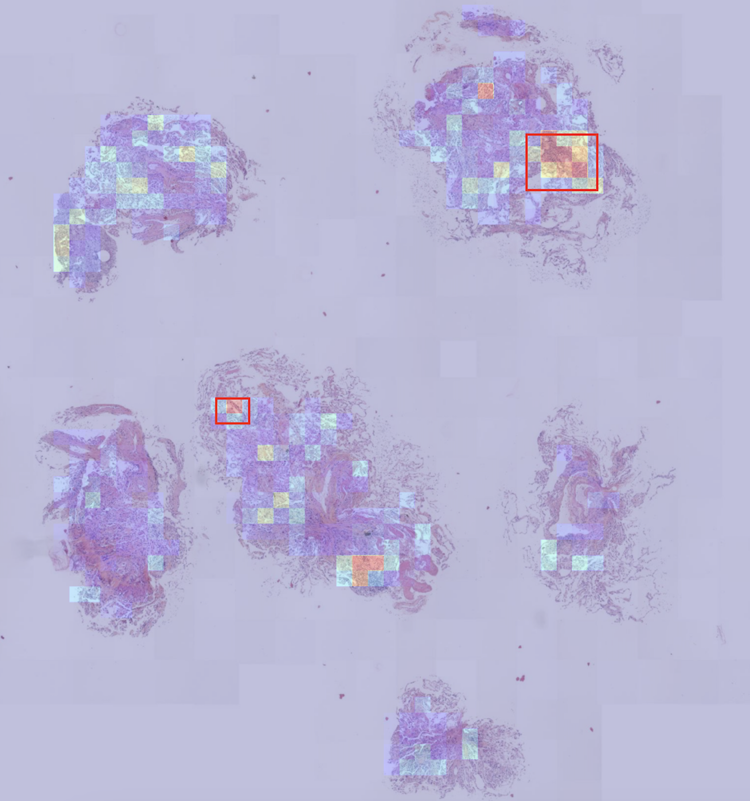
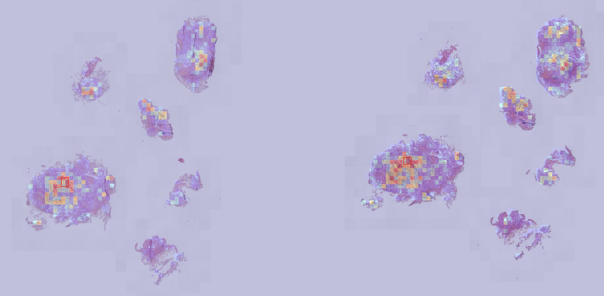
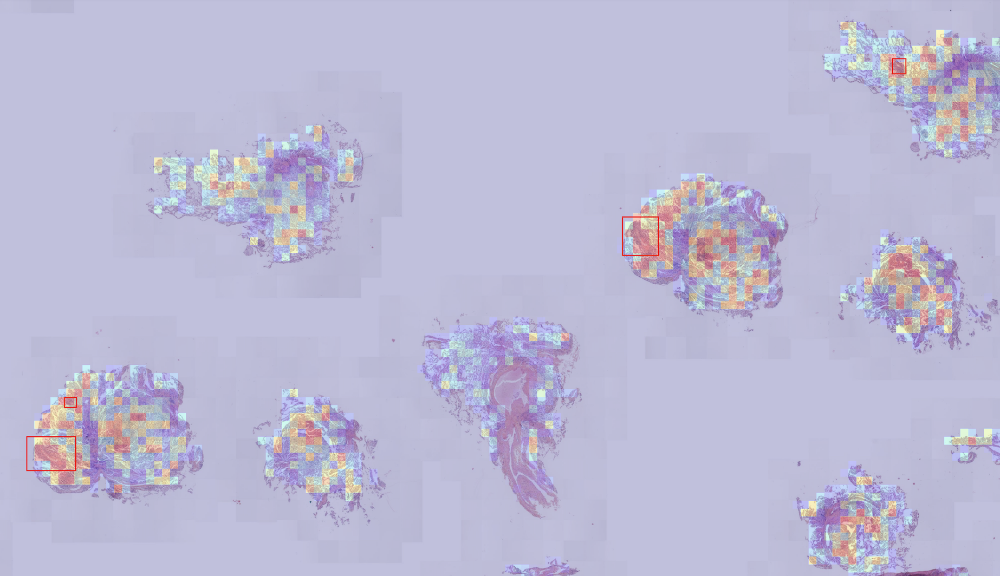
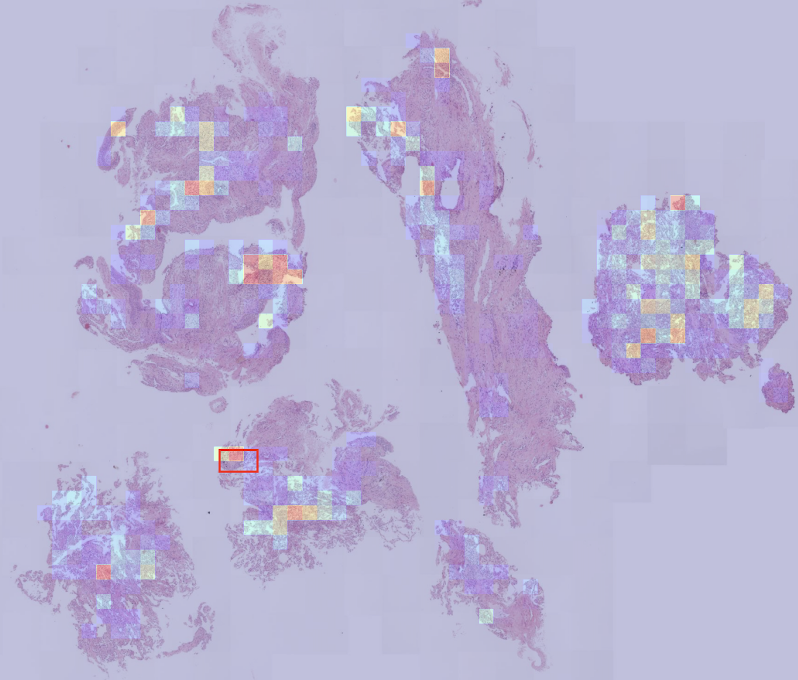
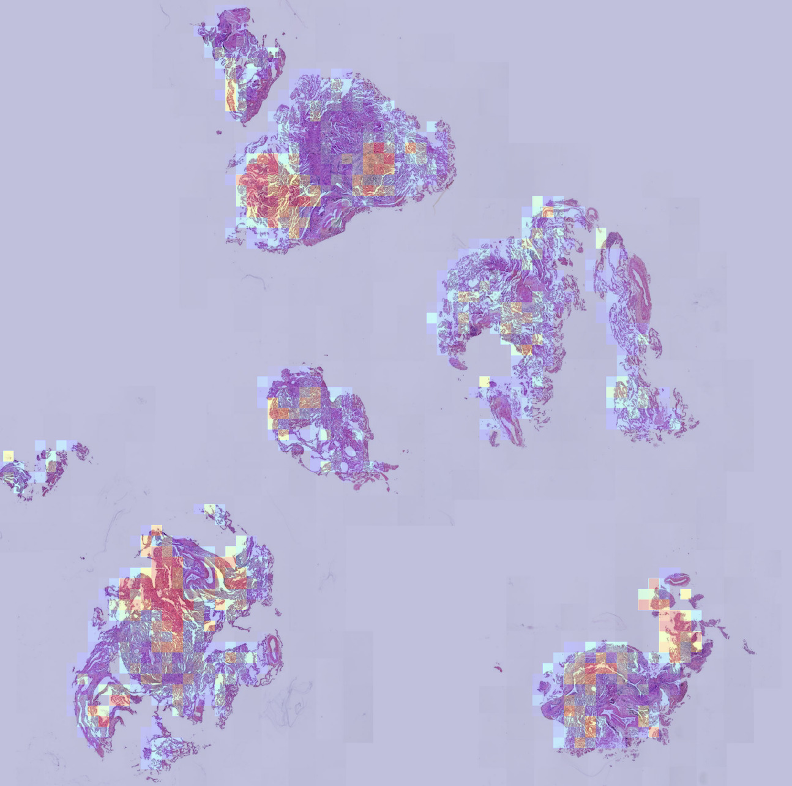

# Results

!!! note ""
    Here are the metrics and some heatmaps to visualize the results.

## Patch classification

### Metrics

Metrics were computed over the test set (20% of the annotated slides). The classification threshold is set at 0.5. The best model (without ensemble) yields the following results:

| Metric     | Value   |
|------------|---------|
| Recall     | 0.5364  |
| Precision   | 0.0336  |
| F1 Score   | 0.0633  |

### Examples

I have added heatmaps to visualize the results directly on the slides. The slides are downsampled to reduce their size, resulting in lower resolution.

The heatmaps confirm the metrics: the model **typically detects positive patches but also triggers a significant number of false alarms**.

---

#### Successful Predictions

Two zones match the ground truth bounding boxes. A third zone in the center represents a false positive (FP) cluster.

In some cases, the model demonstrates satisfactory discrimination capabilities.

#### Failed Predictions

Here, the model successfully detects a small bounding box. While large regions of the image do not trigger alarms, which is encouraging, some regions do incorrectly trigger the model.

Additionally, I noted that the model struggles with slides that have unusual staining patterns. I believe that implementing some stain normalization could be beneficial.

## Detection

To be continued ...
